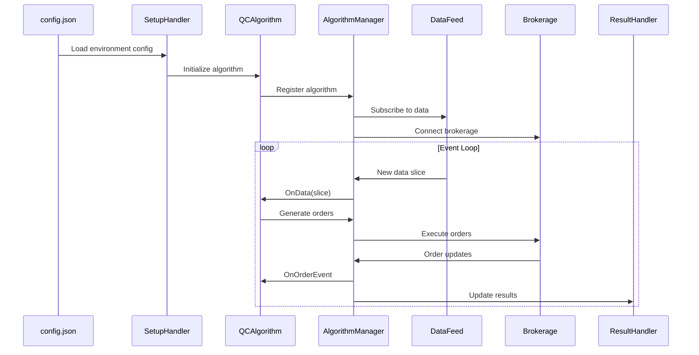
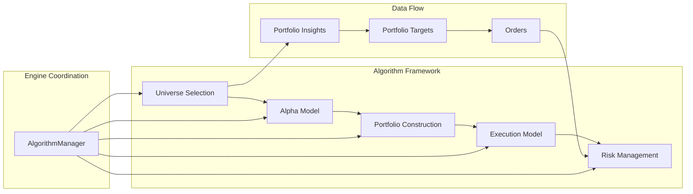
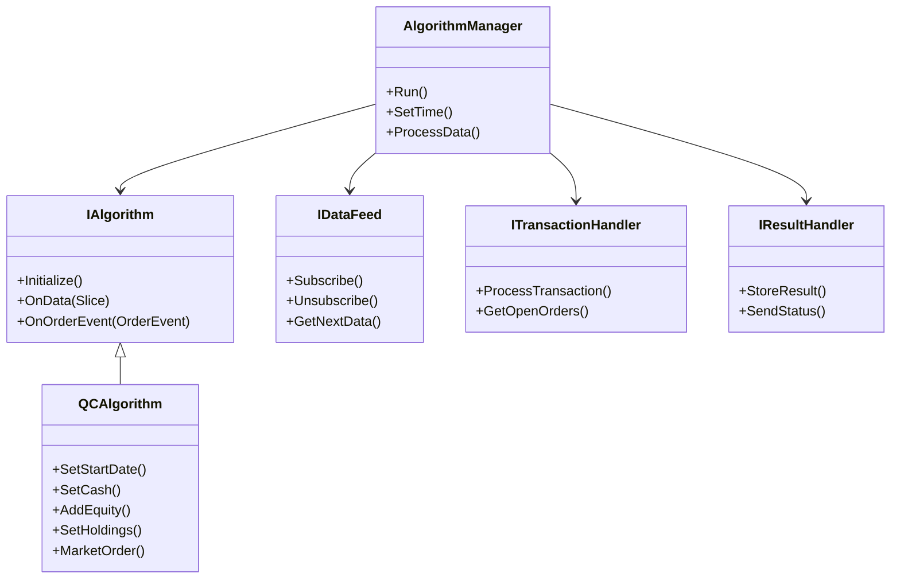
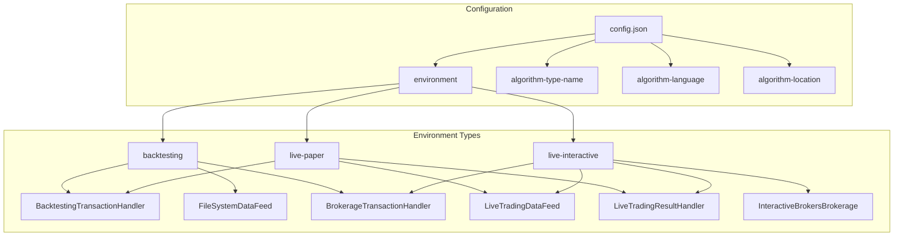
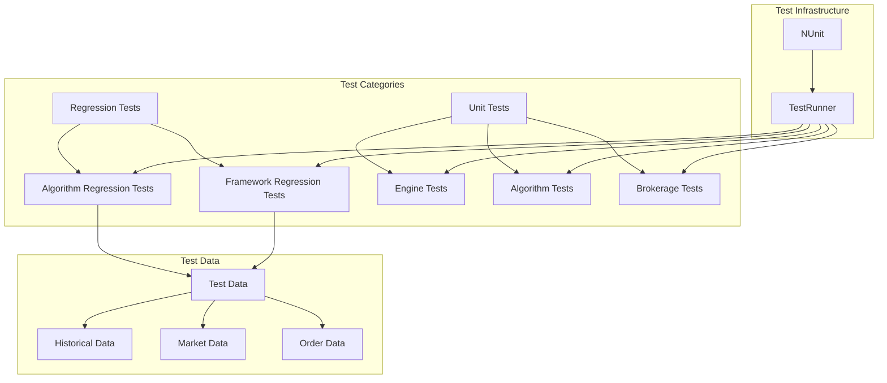

# LEAN Algorithmic Trading Engine - Architecture Visualization

## Core Engine Architecture

```mermaid
graph TB
    subgraph "Algorithm Layer"
        A[QCAlgorithm] --> AF[Algorithm Framework]
        A --> AC[Algorithm.CSharp]
        A --> AP[Algorithm.Python]

        subgraph "Algorithm Framework"
            AF --> AM[Alpha Models]
            AF --> PC[Portfolio Construction]
            AF --> EM[Execution Models]
            AF --> RM[Risk Management]
            AF --> US[Universe Selection]
        end
    end

    subgraph "Engine Layer"
        E[AlgorithmManager] --> DF[DataFeed]
        E --> TH[TransactionHandler]
        E --> RH[ResultHandler]
        E --> SH[SetupHandler]
        E --> RT[RealTimeHandler]
    end

    subgraph "Data Layer"
        DL[Common] --> BD[BaseData]
        DL --> SY[Symbol]
        DL --> SC[Securities]
        DL --> OR[Orders]
    end

    subgraph "Brokerage Layer"
        BL[Brokerages] --> IB[Interactive Brokers]
        BL --> BI[Binance]
        BL --> CO[Coinbase]
        BL --> OT[Other Brokerages...]
    end

    subgraph "Infrastructure"
        I[Configuration] --> CF[config.json]
        I --> LG[Logging]
        I --> MS[Messaging]
        I --> QU[Queues]
    end

    A --> E
    E --> DL
    E --> BL
    E --> I

    subgraph "Testing Layer"
        T[Tests] --> RT[Regression Tests]
        T --> UT[Unit Tests]
    end

    E --> T
    A --> T
```

## Data Flow Architecture

## Framework Model Architecture

## Component Relationships

## Environment Configuration Architecture

## Testing Architecture

## Key Architectural Patterns

### Handler Pattern

- Each major component (DataFeed, TransactionHandler, ResultHandler) implements an interface
- Different implementations for backtesting vs live trading
- Configurable via `config.json` environments

### Event-Driven Architecture

- AlgorithmManager processes time slices in event loop
- Data arrives asynchronously through DataFeed
- Orders processed asynchronously through TransactionHandler
- Results updated continuously through ResultHandler

### Modular Framework System

- Optional framework components can be mixed and matched
- Models emit events rather than direct calls
- Engine coordinates between models
- Framework models are silent (no logging/charting)

### Configuration-Driven Behavior

- Single `config.json` controls all behavior
- Environment switching changes handler implementations
- Brokerage-specific configurations
- Algorithm selection and parameters

### Partial Class Architecture

- QCAlgorithm split across multiple files by concern
- `QCAlgorithm.cs` - Core lifecycle
- `QCAlgorithm.Trading.cs` - Order APIs
- `QCAlgorithm.Framework.cs` - Framework integration
- `QCAlgorithm.History.cs` - Historical data
- `QCAlgorithm.Indicators.cs` - Technical indicators
- `QCAlgorithm.Universe.cs` - Universe selection

This architecture enables LEAN to support both simple algorithmic trading strategies and complex institutional-grade portfolio management systems through its modular, pluggable design.
